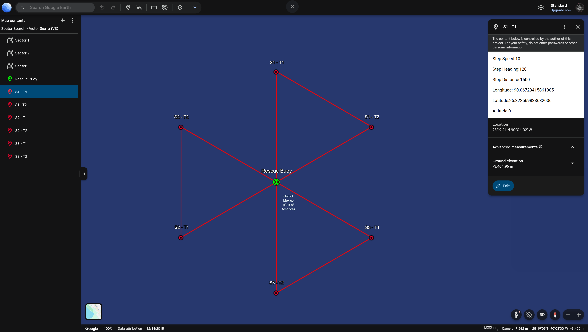
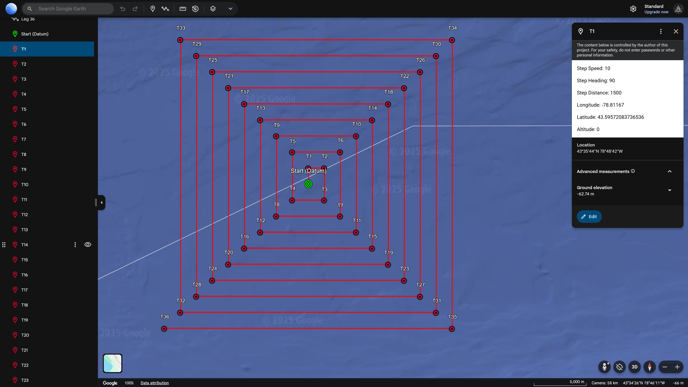

# 🎯 TargetSweeper-360

> **Advanced Tactical Search Pattern Generator for Search & Rescue Operations**

[](https://www.typescriptlang.org/)
[](https://nodejs.org/)
[](https://www.docker.com/)
[](https://opensource.org/licenses/ISC)

## 📋 Table of Contents

- [Overview](#-overview)
- [Demo](#-demo)
- [Features](#-features)
- [Quick Start](#-quick-start)
- [Search Patterns](#-search-patterns)
- [Server API](#-server-api)
- [Docker Deployment](#-docker-deployment)
- [Configuration](#-configuration)
- [Label Formats](#-label-formats)
- [Output Files](#-output-files)
- [Project Structure](#-project-structure)
- [API Reference](#-api-reference)
- [Contributing](#-contributing)
- [License](#-license)

## 🌟 Overview

TargetSweeper-360 is a professional-grade tactical search pattern generator designed for search and rescue operations, surveillance missions, and systematic area coverage. The system provides both standalone pattern generation and a full-featured web API server for generating precise search patterns around target locations with customizable parameters and multiple output formats.

### Key Capabilities

- 🎯 **Multiple Search Patterns** - Sector Search, Parallel Track, Expanding Square, and more
- 📐 **MOA-Based Precision** - Military-grade angular precision using Minutes of Angle
- 🌐 **Web API Server** - RESTful API with HTTPS support for remote pattern generation
- 🗺️ **Multiple Formats** - CSV, KML, and KMZ outputs for various mapping platforms
- 🏷️ **8 Label Styles** - From tactical military to descriptive civilian formats
- 📦 **Project Management** - Upload, manage, and generate multiple search projects
- 🐳 **Docker Ready** - Containerized deployment with automatic HTTPS
- ⚡ **High Performance** - Efficient algorithms for large-scale pattern generation

## 🎬 Demo

See the TargetSweeper-360 output in action! This video demonstrates importing a generated KMZ file into Google Earth:

https://github.com/user-attachments/assets/9ba5b410-576b-4bb0-9b93-797aac2dff2b

_Video: Demonstration of importing TargetSweeper-360 generated KMZ file into Google Earth with tactical sweep pattern visualization_

**What you'll see in the demo:**

- 🎯 Visualizing the complete sweep pattern around target location
- 📍 Tactical sweep points with MOA-based precision
- 🏷️ Point labels showing distance, direction, and timing
- 🎨 Color-coded rings and styling for operational clarity

### 📸 Example Pattern Outputs

Here are examples of the different search patterns generated by TargetSweeper-360:

#### 🎯 Sector Search Pattern (Victor Sierra - VS)


_Systematic angular sweeps from a central point - ideal for target acquisition in known general areas_

#### 📏 Parallel Track Pattern (Papa Sierra - PS)


_Linear search tracks with defined spacing - perfect for large area systematic coverage_

#### 🔄 Expanding Square Search (Sierra - SS)


_Square spiral pattern expanding outward - optimal for last known position searches_

---

## ✨ Features

### ✨ **8 Professional Label Formats**

Choose from multiple labeling styles to match your operational requirements:

| Format               | Example                        | Use Case              |
| -------------------- | ------------------------------ | --------------------- |
| **TACTICAL**         | `NNE-050-1500-0025`            | Military operations   |
| **DESCRIPTIVE**      | `50m NNE @1h (25min/1500MOA)`  | Training & briefings  |
| **CLOCK_NAVIGATION** | `R50 @01:00 NNE (30°/1500MOA)` | Navigation teams      |
| **COMPACT_GRID**     | `NNE50-00:25-1500`             | Radio communications  |
| **BEARING_RANGE**    | `BRG030-RNG050-MOA1500-T0025`  | Artillery & surveying |
| **SEARCH_PATTERN**   | `SP-NNE-050m-00:25-1500MOA`    | Search & rescue       |
| **AVIATION**         | `RADIAL030/050M/1500/0025Z`    | Aviation operations   |
| **SIMPLE**           | `NNE 50m @00:25 (1500MOA)`     | General purpose       |

### 🔍 **Multiple Search Pattern Types**

TargetSweeper-360 supports various search patterns for different operational needs:

- **🎯 Sector Search (Victor Sierra - VS)** - Systematic angular sweeps from a central point
- **📏 Parallel Track (Papa Sierra - PS)** - Linear search tracks with defined spacing
- **🔄 Expanding Square Search (Sierra - SS)** - Square spiral pattern expanding outward
- **⚡ Creeping Line (Charlie Sierra - CS)** - Progressive linear advancement
- **🚧 Barrier Search (Bravo Sierra - BS)** - Perimeter and boundary searches
- **⭕ Concentric Circles** - Radial ring-based search patterns

### 🌐 **Web API Server**

- **REST API** - Full HTTP API for remote pattern generation
- **HTTPS Support** - Secure connections with SSL/TLS certificates
- **Project Management** - Upload, store, and manage search projects
- **File Processing** - Handle KML/KMZ uploads and conversions
- **Cross-Origin Support** - CORS enabled for web applications

### 📊 **Multiple Output Formats**

- **CSV** - Raw data for analysis and custom applications
- **KML** - Google Earth and GIS platform compatibility
- **KMZ** - Compressed format with styling and metadata

## 🚀 Quick Start

### Prerequisites

- Node.js 18+ (22+ recommended)
- npm or yarn package manager
- Docker (optional, for containerized deployment)

### Installation

```bash
# Clone the repository
git clone https://github.com/Izocel/TargetSweeper-360.git
cd TargetSweeper-360

# Install dependencies
npm install

# Build the project
npm run build
```

### Basic Usage

```bash
# Generate patterns (standalone mode)
npm run dev

# Start the API server (development)
npm run dev:server

# Start the API server (production)
npm run start:server

# Run tests
npm test

# Generate SSL certificates
npm run certs
```

### Docker Deployment

```bash
# Build and start with Docker Compose
docker-compose up -d

# The server will be available at https://localhost:3000
```

## 🔍 Search Patterns

TargetSweeper-360 supports multiple search pattern types, each optimized for specific operational scenarios:

### 🎯 Sector Search (Victor Sierra - VS)

Systematic angular sweeps from a central point, ideal for:

- Target acquisition in known general areas
- Surveillance operations with directional focus
- Resource-limited search operations

### 📏 Parallel Track (Papa Sierra - PS)

Linear search tracks with defined spacing, perfect for:

- Large area systematic coverage
- Maritime and aerial search patterns
- Ground team coordination

### � Expanding Square Search (Sierra - SS)

Square spiral pattern expanding outward from the target:

- Last known position searches
- Systematic area expansion
- High-probability area coverage

### ⚡ Creeping Line (Charlie Sierra - CS)

Progressive linear advancement across search areas:

- Methodical terrain coverage
- Team-based search operations
- Evidence collection patterns

### 🚧 Barrier Search (Bravo Sierra - BS)

Perimeter and boundary-focused searches:

- Containment operations
- Border and checkpoint patterns
- Escape route monitoring

### ⭕ Concentric Circles

Radial ring-based search patterns:

- Distance-based probability searches
- Uniform coverage around targets
- Range-finding operations

## � Core Library

The heart of TargetSweeper-360 - advanced pattern generation algorithms, mathematical models, and utility functions for creating precise tactical search patterns.

📖 **[Complete Core Library Documentation →](src/lib/README.md)**

**Key Features:**

- 🔧 **Direct Pattern Generation** - Use the core engine without server dependency
- 📐 **Mathematical Precision** - Military-grade calculations and geodetic algorithms
- 🏷️ **8 Label Formats** - Professional labeling for all operational requirements
- 📄 **Multiple Outputs** - KML, KMZ, CSV generation with custom styling
- ⚡ **High Performance** - Optimized for large-scale pattern generation

## 🌐 Server API

📖 **[Complete Server API Documentation →](src/server/README.md)**

## 📦 API SDK

📖 **[Complete API SDK Documentation →](src/api/README.md)**

## 🐳 Docker Deployment

TargetSweeper-360 is containerized and ready for production deployment.

### Docker Compose Setup

```yaml
services:
  server:
    container_name: TargetSweeper-360
    build: .
    ports:
      - "3000:3000"
    environment:
      - NODE_ENV=production
      - HTTPS=true
    volumes:
      - ./projects:/app/projects
      - ./certs:/app/certs
```

### SSL/TLS Configuration

The server supports automatic HTTPS with SSL certificates:

```bash
# Generate self-signed certificates
npm run certs

# Or mount existing certificates
docker run -v /path/to/certs:/app/certs targetsweeper-360
```

### Environment Variables

| Variable   | Default       | Description         |
| ---------- | ------------- | ------------------- |
| `PORT`     | `3000`        | Server port number  |
| `HTTPS`    | `true`        | Enable HTTPS server |
| `NODE_ENV` | `development` | Environment mode    |

## 🏷️ Label Formats

### Military & Tactical

**TACTICAL**: Hyphen-separated military format

```
N-010-0300-0000, NNE-050-1500-0025, E-100-5400-0090
```

**BEARING_RANGE**: Military bearing and range format

```
BRG000-RNG010-MOA0300-T0000, BRG030-RNG050-MOA1500-T0025
```

**AVIATION**: Aviation radial format with Zulu time

```
RADIAL000/010M/0300/0000Z, RADIAL030/050M/1500/0025Z
```

### Navigation & Field Use

**CLOCK_NAVIGATION**: Clock position with bearing

```
R10 @12:00 N (0°/300MOA), R50 @01:00 NNE (30°/1500MOA)
```

**SEARCH_PATTERN**: Search pattern with SP prefix

```
SP-N-010m-00:00-300MOA, SP-NNE-050m-00:25-1500MOA
```

### Communication & Compact

**COMPACT_GRID**: Minimal characters for radio

```
N10-00:00-300, NNE50-00:25-1500, E100-01:30-5400
```

### Training & Documentation

**DESCRIPTIVE**: Human-readable with full context

```
10m N @12h (0min/300MOA), 50m NNE @1h (25min/1500MOA)
```

**SIMPLE**: Clean format for general use

```
N 10m @00:00 (300MOA), NNE 50m @00:25 (1500MOA)
```

## 📄 Output Files

### CSV Format

Raw tabular data with coordinates and metadata:

```csv
WKT,Description
"POINT (-122.4192862 37.7749000)",N 10m @03:00 (0MOA)
"POINT (-122.4192867 37.7749078)",N 10m @03:05 (300MOA)
"POINT (-122.4192880 37.7749156)",N 10m @03:10 (600MOA)
```

### KML Format

Google Earth compatible markup with enhanced styling:

```xml
<?xml version="1.0" encoding="UTF-8"?>
<kml xmlns="http://www.opengis.net/kml/2.2">
    <Document>
        <name>TargetSweeper-360 - Search Pattern</name>
        <Placemark>
            <name>N 10m @03:00 (0MOA)</name>
            <Point>
                <coordinates>-122.4192862,37.7749000,0</coordinates>
            </Point>
        </Placemark>
    </Document>
</kml>
```

### KMZ Format

Compressed KML with enhanced styling and metadata:

- **Color-coded rings** - Distance-based visual classification
- **Pattern overlays** - Search area boundaries and sectors
- **Detailed placemarks** - Rich descriptions with timing and coordinates
- **Google Earth optimization** - Enhanced performance for large datasets

## 📁 Project Structure

```
TargetSweeper-360/
├── 📁 src/                     # Source code
│   ├── 📁 api/                 # API client
│   │   ├── index.ts            # Main API class
│   │   ├── ProjectsApi.ts      # Projects API endpoints
│   │   └── README.md           # API SDK documentation
│   ├── 📁 lib/                 # Core library
│   │   ├── README.md           # Core library documentation
│   │   ├── 📁 constants/
│   │   │   └── 📁 enums/
│   │   │       ├── LabelFormats.ts    # Label format definitions
│   │   │       └── PaternTypes.ts     # Search pattern types
│   │   ├── 📁 models/          # Data models
│   │   │   ├── BaseModel.ts
│   │   │   ├── ExpandingSquarePattern.ts
│   │   │   ├── ParallelTrackPattern.ts
│   │   │   ├── SectorSearchPattern.ts
│   │   │   ├── SweeperConfigs.ts
│   │   │   ├── SweepPoint.ts
│   │   │   └── Target.ts
│   │   ├── 📁 services/        # Business logic
│   │   │   ├── KMLGenerator.ts      # KML/KMZ generation
│   │   │   ├── PatternGenerator.ts  # Pattern algorithms
│   │   │   └── ProjectManager.ts    # Project management
│   │   └── 📁 utils/           # Utility functions
│   │       ├── DirectionCalculator.ts
│   │       ├── GeoCalculator.ts
│   │       └── Math.ts
│   ├── 📁 server/              # Web server
│   │   ├── README.md           # Server API documentation
│   │   ├── index.ts            # Server entry point
│   │   ├── Server.ts           # Express server setup
│   │   ├── 📁 controllers/     # Request handlers
│   │   │   └── ProjectController.ts
│   │   ├── 📁 requests/        # Request models
│   │   │   ├── BaseRequest.ts
│   │   │   ├── GetProjectRequest.ts
│   │   │   ├── PutProjectRequest.ts
│   │   │   └── UploadProjectRequest.ts
│   │   ├── 📁 routes/          # API routes
│   │   │   └── ProjectRoutes.ts
│   │   └── 📁 storages/        # File handling
│   │       └── FileUploadsHandler.ts
│   ├── 📁 tests/               # Test files
│   │   ├── index.ts
│   │   ├── ESS-Examples.ts     # Expanding Square tests
│   │   ├── PTS-Examples.ts     # Parallel Track tests
│   │   └── SSP-Examples.ts     # Sector Search tests
│   └── index.ts                # Library exports
├── 📁 projects/                # Generated patterns
│   ├── 📁 ExpandingSquarePatterns/
│   ├── 📁 ParallelTrackPatterns/
│   ├── 📁 SectorSearchPatterns/
│   └── 📁 Urban_Surveillance_Zone_Alpha/
├── 📁 certs/                   # SSL certificates
│   ├── cert.pem
│   └── key.pem
├── 📁 scripts/                 # Utility scripts
│   └── generate-certs.sh
├── Dockerfile                  # Docker configuration
├── docker-compose.yml          # Docker Compose setup
├── package.json               # Dependencies and scripts
├── tsconfig.json              # TypeScript configuration
└── README.md                  # Documentation
```

## 🔧 Class References

### Core Classes

#### `PatternTypes`

Enumeration of available search pattern types.

```typescript
import { PatternTypes } from "targetsweeper-360";

const patterns = [
  PatternTypes.SECTOR_SEARCH, // Sector Search - Victor Sierra (VS)
  PatternTypes.PARALLEL_TRACK, // Parallel Track - Papa Sierra (PS)
  PatternTypes.EXPANDING_SQUARE_SEARCH, // Expanding Square Search - Sierra (SS)
  PatternTypes.CREEPING_LINE, // Creeping Line - Charlie Sierra (CS)
  PatternTypes.BARRIER_SEARCH, // Barrier Search - Bravo Sierra (BS)
  PatternTypes.CONCENTRIC_CIRCLES, // Concentric Circles
];
```

#### `LabelFormat`

Label formatting options with utility functions.

```typescript
import { LabelFormat, LabelFormatter } from "targetsweeper-360";

// Get formatted label
const label = LabelFormatter.formatLabel(LabelFormat.TACTICAL, {
  direction: "NNE",
  distance: 50,
  angle: 30,
  moa: 1500,
  timeMinutes: 25,
  clockHour: 1,
  clockMinutes: 0,
});
// Result: "NNE-050-1500-0025"

// Get examples for all formats
const examples = LabelFormatter.getExamples();
```

## 🔬 Technical Specifications

### Coordinate System

- **Datum**: WGS84 (World Geodetic System 1984)
- **Precision**: Sub-meter accuracy using double-precision floating point
- **Format**: Decimal degrees with scientific notation support

### Angular Measurements

- **Primary Unit**: Minutes of Angle (MOA)
- **Conversion**: 1° = 60 MOA = 3600 arcseconds
- **Precision**: 1 MOA ≈ 1.047 inches at 100 yards
- **Military Standard**: NATO STANAG 4677 compliant

### Server Specifications

- **Protocol**: HTTP/HTTPS with TLS 1.2+
- **API Format**: RESTful JSON API
- **Authentication**: Token-based (configurable)
- **CORS**: Configurable cross-origin support
- **File Uploads**: Multipart form data with validation

### Performance

- **Pattern Generation**: ~10,000 points/second
- **Memory Usage**: <100MB for typical operations
- **File Sizes**: CSV ~50KB, KMZ ~150KB per 1000 points
- **Concurrent Requests**: 100+ simultaneous API requests

### Supported File Formats

- **Input**: KML, KMZ, CSV, JSON
- **Output**: KML, KMZ, CSV, WKT
- **Compression**: ZIP (KMZ), GZIP (optional)

## 🤝 Contributing

We welcome contributions! Please see our [Contributing Guidelines](CONTRIBUTING.md) for details.

### Development Setup

```bash
# Clone and setup
git clone https://github.com/Izocel/TargetSweeper-360.git
cd TargetSweeper-360

# Install dependencies
npm install

# Development mode (library)
npm run dev

# Development mode (server)
npm run dev:server

# Watch mode (auto-rebuild)
npm run watch

# Run tests
npm test

# Build for production
npm run build

# Generate certificates
npm run certs
```

### Available Scripts

| Script                 | Description                      |
| ---------------------- | -------------------------------- |
| `npm run build`        | Compile TypeScript to JavaScript |
| `npm run watch`        | Watch mode for development       |
| `npm run clean`        | Remove build artifacts           |
| `npm start`            | Run compiled application         |
| `npm run dev`          | Run in development mode          |
| `npm test`             | Execute test suite               |
| `npm run dev:server`   | Start development server         |
| `npm run start:server` | Start production server          |
| `npm run certs`        | Generate SSL certificates        |

### Code Style

- **TypeScript** with strict type checking enabled
- **CommonJS** module system for Node.js compatibility
- **ESLint** configuration for code quality
- **Prettier** integration for consistent formatting
- **JSDoc** comments for comprehensive documentation

### Testing

Run the comprehensive test suite covering all pattern types:

```bash
# Run all tests
npm test

# Test specific pattern
npm run test:sector-search
npm run test:parallel-track
npm run test:expanding-square
```

## 📄 License

This project is licensed under the ISC License - see the [LICENSE](LICENSE) file for details.

### ISC License

```
ISC License

Copyright (c) 2025, Izocel

Permission to use, copy, modify, and/or distribute this software for any
purpose with or without fee is hereby granted, provided that the above
copyright notice and this permission notice appear in all copies.

THE SOFTWARE IS PROVIDED "AS IS" AND THE AUTHOR DISCLAIMS ALL WARRANTIES
WITH REGARD TO THIS SOFTWARE INCLUDING ALL IMPLIED WARRANTIES OF
MERCHANTABILITY AND FITNESS. IN NO EVENT SHALL THE AUTHOR BE LIABLE FOR
ANY SPECIAL, DIRECT, INDIRECT, OR CONSEQUENTIAL DAMAGES OR ANY DAMAGES
WHATSOEVER RESULTING FROM LOSS OF USE, DATA OR PROFITS, WHETHER IN AN
ACTION OF CONTRACT, NEGLIGENCE OR OTHER TORTIOUS ACTION, ARISING OUT OF
OR IN CONNECTION WITH THE USE OR PERFORMANCE OF THIS SOFTWARE.
```

## 🙏 Acknowledgments

- **Built with TypeScript and Node.js** - Modern JavaScript ecosystem
- **Express.js** - Fast, unopinionated web framework
- **Docker** - Containerization for consistent deployment
- **KML/KMZ Standards** - Google Earth and OGC compliant output
- **MOA Calculations** - Based on military surveying and ballistics principles
- **Geodetic Algorithms** - Adapted from standard GIS and cartographic libraries
- **Search Pattern Theory** - Inspired by SAR (Search and Rescue) best practices
- **Military Standards** - NATO STANAG compliance for tactical applications

### Third-Party Libraries

- **axios** - HTTP client for API communication
- **express** - Web framework for server functionality
- **jszip** - ZIP file generation for KMZ format
- **multer** - File upload handling
- **zod** - Runtime type validation
- **cors** - Cross-origin resource sharing
- **morgan** - HTTP request logging

---

<div align="center">

**🎯 TargetSweeper-360 - Advanced Search Pattern Generation**

_Professional-grade tools for search and rescue operations_

[GitHub Repository](https://github.com/Izocel/TargetSweeper-360) • [API Documentation](src/api/README.md) • [Contributing Guidelines](CONTRIBUTING.md)

Made with ❤️ by [Izocel](https://github.com/Izocel)

</div>
